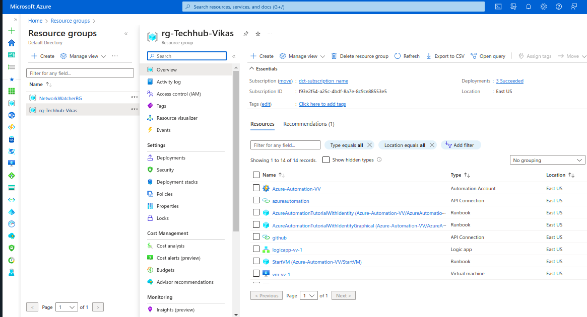
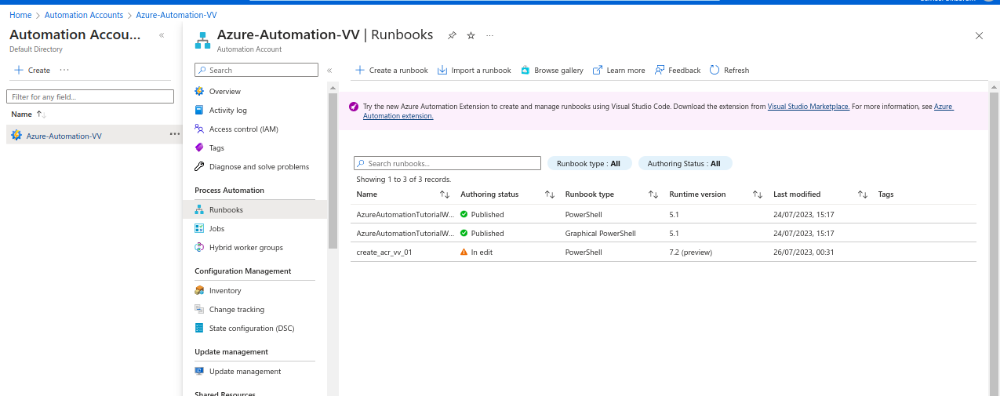
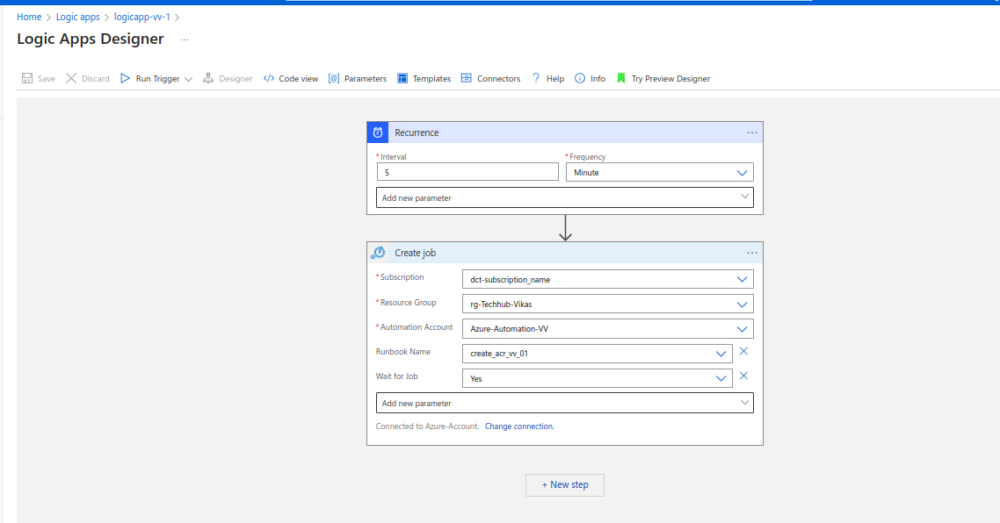
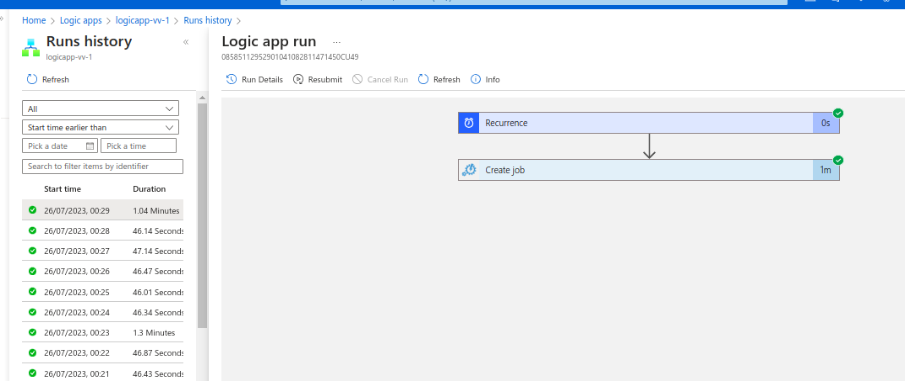
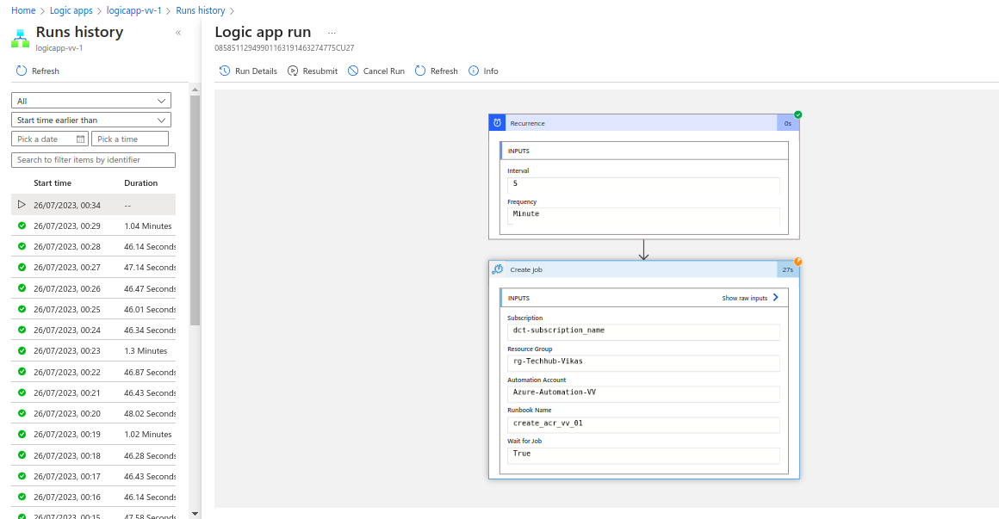
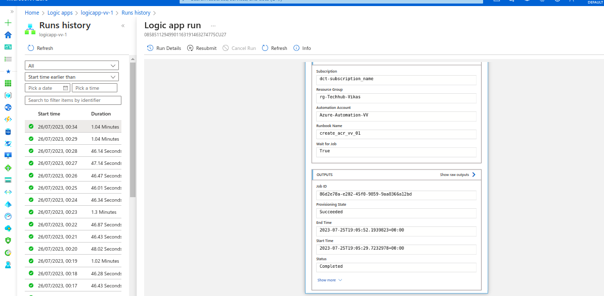
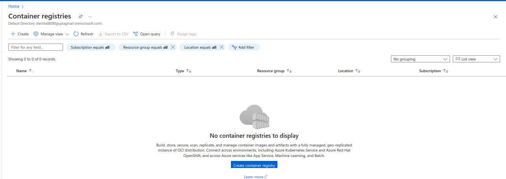
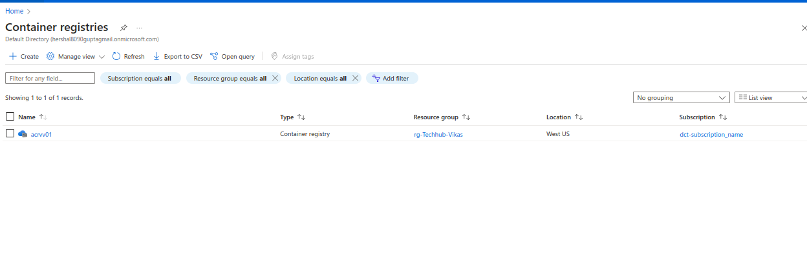
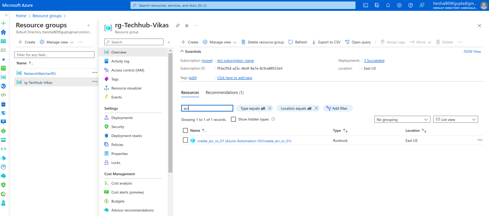
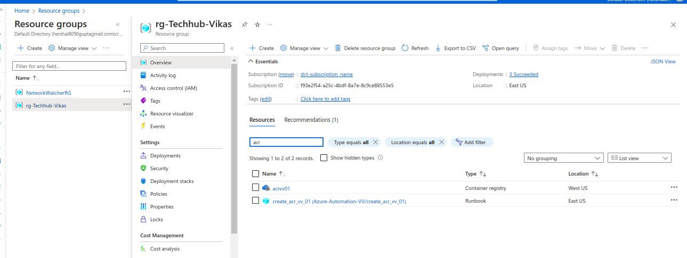

## Description

Here, In this template, we will create a runbook to perform automation using the Azure Automation for ACR creation using the Logic App.

---
##### Pre-Requisite

* Azure Account

---
### Steps

* Login into your Azure portal.
* Create a Logic App Workflow and add recurrence as a trigger point of logic app as we have used in this template.
* Create a Azure Automation Account.
* Create a Runbook inside your automation account like we have used Powershell 7.1 in this template.
* Add the Azure Automation account in the action of logic app workflow along with the runbook which you want to trigger.

---
#### Note

* Please change your account details in the `scripts` directory in the files. 

---

### Outputs

1. First, we need to create a resource-group consists of our Logic App creation and Azure Automation account :

2. We need to have an azure automation in Azure to create runbook for the Automation Jobs :

3. Now, we need to create the Logic app designer or we can also use the JSON app code : 

If we use the JSON code, please change the names as per your account in `scripts>logic-app-code.json` . 

As we have added a recurrence as a trigger point which is triggering the flow in every 5 minutes and created action for Azure Automation which is targeting our Automation Account with the Runbook which we want to use.

4. As, the logic app has been triggered using the recurrence trigger point :

Before :

Started :

After :

5. As Logic App has been completed successfully, we have checked as runbook worked properly or not :

Before:

After :

6. Also , our resource group also has the new resource with the name `acrvv01` :

Before :

After :

---